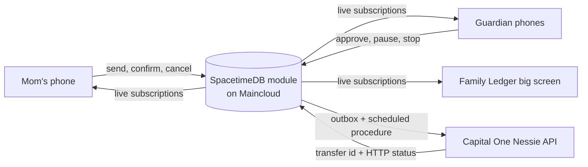

# Aval

**Scams need silence. Aval brings the family in.**

Aval is a family safety hold for an older parent's bank account. Everyday payments go straight through. Risky ones wait at the bank while the family decides together, live on their phones.

- **Live demo:** https://aval-liart.vercel.app/demo
- **Devpost and demo video:** https://devpost.com/software/aval

Built at MHacks 2026 for the Capital One Nessie, SpacetimeDB and FinTech tracks.

---

## The story

Margaret gets a call. A man from "tech support" says her computer has a virus and he can fix it for $2,000. He tells her not to tell anyone.

She sends the money. Aval holds it at the bank, and her son Alex and daughter Alexis see it on their phones right away, with every reason it was flagged. They stop it, and the bank sends all $2,000 back to Margaret's checking. The scammer gets nothing.

## How it works

1. **Normal payments go straight through.** Known billers and family are paid right away.
2. **Risky payments are held.** Aval scores the payee with live Capital One Nessie data. If it looks risky, a real Nessie transfer moves the money into an Aval Hold account.
3. **The family sees it live.** Every guardian's phone shows the payment and the reasons.
4. **Release takes two keys.** Mom confirms *and* one guardian approves. Mom first answers: *"Were you told to keep this secret?"* If she says yes, her approval stops counting and every guardian sees "Call her now."
5. **A 60-second objection window** follows approval. Any guardian can pause.
6. **Two stops send it home.** Two different guardians tap Stop, or Mom cancels, and the money transfers back to her.
7. **If nobody acts, the hold refunds itself** (150 seconds in the demo, 24 hours in real use).

Nobody acts alone. Held money is never sent without Mom's confirmation, and every refund goes back to her own account.

## Architecture



### SpacetimeDB: the whole backend

There is no other server. One TypeScript module (`spacetimedb/src/index.ts`) holds the family, payments, ledger, timers and bank log.

- **Reducers enforce the rules:** only Mom can confirm, stops must come from two different identities, and a "yes" to the secrecy question voids Mom's key. Reducers are transactional, so if two guardians tap Approve at once, exactly one wins.
- **Scheduled tables are the clock:** the objection window and the auto-refund fire even when every phone is closed.
- **Procedures call the bank:** reducers write an outbox row. A scheduled procedure calls Nessie over HTTP, checks the payment state before sending, and records the result.
- **Lifecycle reducers** (`clientConnected` / `clientDisconnected`) show who in the family is online.
- **The Nessie API key** lives in a private table. It never reaches the browser and is stripped from logs.

### Capital One Nessie: the bank

- **The risk score comes from live reads:** `GET /customers`, `GET /accounts/{id}/transfers`, `GET /accounts/{id}` and `GET /enterprise/bills`.
- **Every movement is a real transfer** (`POST /accounts/{id}/transfers`):

| Kind | From | To |
|---|---|---|
| `DIRECT` | Mom | Payee |
| `HOLD` | Mom | Aval Hold |
| `RELEASE` | Aval Hold | Payee |
| `REFUND` | Aval Hold | Mom |

Nessie doesn't change balances after a transfer, so Aval keeps its own ledger and uses each Nessie transfer record as the receipt.

### Frontend

React, Vite, Tailwind and Framer Motion, designed as a warm family scrapbook. Mom gets large type and big buttons. The `/demo` big screen has a QR code so anyone can join the family from their phone. It's hosted on Vercel.

## Repo layout

| Path | What's inside |
|---|---|
| `spacetimedb/` | The SpacetimeDB module (TypeScript) |
| `web/` | React app: `/join`, `/mom`, `/guardian`, `/demo` |
| `design-system-src/` | Design system exports: colors, components, typography |
| `docs/` | Nessie API notes |

## Run locally

You need the [SpacetimeDB CLI](https://spacetimedb.com/install), Node 22+ and a Nessie API key from [api.nessieisreal.com](http://api.nessieisreal.com).

```bash
# Terminal 1: start a local SpacetimeDB server
spacetime start

# Terminal 2: publish the module (spacetime.json points to ./spacetimedb and the database "aval")
spacetime publish

# Start the web app
cd web
npm install
npm run dev
```

Then:

1. **Set the Nessie key.** With `spacetime call`, call `join` as `"Bank Admin"` with role `"mom"`, because only a Mom can change settings. Then call `set_config` with `nessie_api_key` and your key. The key stays in a private table.
2. **Join as Mom.** Open `http://localhost:5173/join` and choose **I'm Mom**.
3. **Seed the bank.** Open `/demo` and click **Seed** to create the Nessie customers and accounts.
4. **Join as family.** Scan the QR code, or open `/join` in another browser.

Never commit `.env` or an API key. `.env` is in `.gitignore`.

## Team

- **Tanvir:** backend, SpacetimeDB module, Nessie integration, deployment
- **Mateo:** design system and UI
